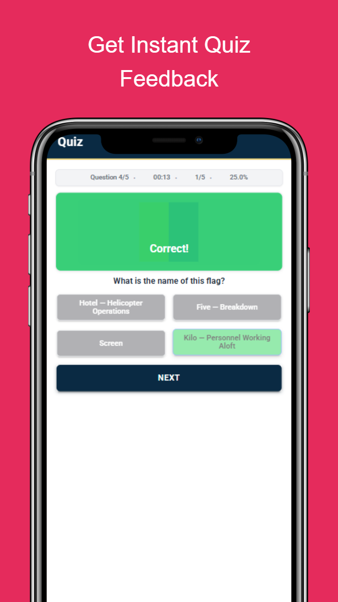
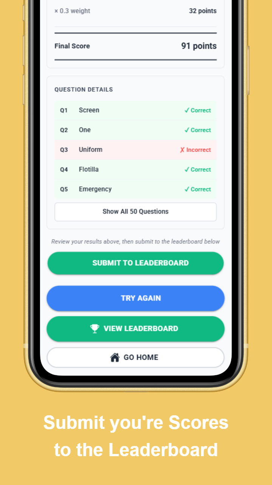

# ⚓ SignalsMaster

**Master Naval Signal Flags Through Interactive Training**

A professional, mobile-first quiz application designed for military personnel, signalers, and cadets to learn, practice, and compete in naval signal flag recognition and knowledge.

---

## 📸 App Preview

<div align="center">
  
  
</div>

<p align="center">
  <em>Interactive quiz feedback • Competitive leaderboard submission • Global rankings</em>
</p>

---

## 🎯 About SignalsMaster

SignalsMaster is your all-in-one training platform for mastering the International Code of Signals. Whether you're a professional signaler, active-duty military personnel, or a cadet looking to earn your signals qualification, this app delivers:

- **Interactive Practice Sessions** – Learn at your own pace with adjustable practice modes
- **Competitive Leaderboards** – Test your skills against fellow signalers worldwide
- **Military-Authentic Content** – Real Naval signal meanings and signal flag data
- **Responsive Design** – Works seamlessly on phones, tablets, and desktops
- **Offline-Ready** – Practice mode works without an internet connection

---

## 🚀 Quick Start

### For Users

1. **Visit the App** – Access SignalsMaster in your browser
2. **Choose Your Mode:**
   - **Practice Mode** – Learn at your pace (10-100 questions)
   - **Competitive Mode** – Challenge for the leaderboard (50 questions)
3. **Answer Questions** – Identify flags by their naval meanings
4. **Track Progress** – See your rating, accuracy, and leaderboard rank

### For Developers

#### Prerequisites
- **Node.js** 18+ and npm
- **Git**
- **Firebase CLI** (for deployment)

#### Installation

```bash
# Clone the repository
git clone https://github.com/mjsamaha/SignalsMaster.git
cd SignalsMaster

# Install dependencies
npm install

# Set up environment configuration
# Copy the template and add your Firebase credentials
cp src/environments/environment.template.ts src/environments/environment.ts
cp src/environments/environment.template.ts src/environments/environment.prod.ts

# Edit the environment files with your Firebase config:
# - Get your Firebase config from Firebase Console > Project Settings
# - Replace placeholder values in environment.ts and environment.prod.ts
# - Set production: false in environment.ts
# - Set production: true in environment.prod.ts

# Start the development server
npm start
```

The app runs on `http://localhost:4200`

> **⚠️ Important:** The `environment.ts` and `environment.prod.ts` files are gitignored for security. Each developer must create these files locally using the template.

#### Build for Production

```bash
# Create optimized production build
npm run build

# Output goes to www/ directory
```

---

## 📚 Features

### Practice Mode
- **Flexible Learning** – Choose 10, 25 or up to 50 questions per session
- **Immediate Feedback** – See correct/incorrect answers instantly with explanations
- **No Pressure** – Focus on learning without leaderboard pressure
- **Progress Tracking** – Review your accuracy and areas for improvement

### Competitive Mode
- **Fixed 50-Question Format** – Standardized assessment for fair ranking
- **Real-Time Leaderboard** – See where you stand against other signalers
- **Rating System** – Earn a 0-100 rating based on accuracy and speed
- **Tier Classification** – Achieve ranks from "Keep Practicing" to "Signals Master"
- **Performance Metrics** – Detailed stats on correct answers and response time

### User Experience
- **Military Aesthetic** – Navy and gold color scheme reflecting naval tradition
- **Responsive Design** – Optimized for mobile (375px+), tablet, and desktop
- **Smooth Animations** – Professional transitions and feedback animations
- **Accessibility** – WCAG AA contrast ratios and touch-optimized controls
- **Fast Performance** – Optimized for low-bandwidth environments

---

## 🏗️ Architecture

### Core Technologies

| Layer | Technology | Version |
|-------|-----------|---------|
| **Framework** | Angular | 20.0 |
| **Mobile** | Ionic Framework + Capacitor | 8.0 / 7.4 |
| **Styling** | Tailwind CSS | 3.4 |
| **Language** | TypeScript | 5.9 |
| **Backend** | Firebase Firestore | 11.10 |
| **Testing** | Karma + Jasmine | 6.4 / 5.1 |

### Application Structure

```
src/app/
├── pages/                    # Feature pages
│   ├── home/                # Main landing & navigation
│   ├── practice-mode/       # Practice setup
│   ├── best-signaller/      # Competitive mode entry
│   ├── quiz/                # Main quiz interface
│   ├── practice-results/    # Practice session results
│   ├── competitive-results/ # Competitive results & leaderboard submission
│   ├── leaderboard/         # Live rankings
│   └── about/               # App information
├── core/services/
│   ├── quiz.service.ts      # Quiz logic & session management
│   ├── leaderboard.service.ts # Firebase integration
│   ├── flag.service.ts      # Flag database management
│   └── leaderboard.service.spec.ts
├── shared/
│   ├── components/          # Reusable UI components
│   │   ├── quiz-question/   # Flag display + options
│   │   ├── score-display/   # Score visualization
│   │   └── timer/           # Question timer
│   └── pipes/
│       └── score.pipe.ts    # Score formatting
├── app.routes.ts            # Routing configuration
└── app.component.ts         # Root component

assets/
├── data/
│   └── flags.json           # Complete flag database
├── flags/
│   ├── letters/             # A-Z signal flags
│   ├── numbers/             # 0-9 numeric pennants
│   ├── pennant-numbers/     # Pennant identifiers
│   ├── special-pennants/    # Operational signals
│   └── substitutes/         # Repetition flags
└── icon/                    # App icons
```

### Key Services

#### **Flag Service** (`flag.service.ts`)
Manages the naval signal flag database containing 54 distinct flags across 5 categories:
- **Letter Flags** (Alpha, Bravo, Charlie, etc.) – Each with phonetic name and naval meaning
- **Numeric Pennants**
- **Pennant Identifiers**
- **Special Pennants**
- **Substitute Flags** 

```typescript
interface Flag {
  id: string;              // Unique identifier (e.g., "letter-a")
  name: string;            // Phonetic name (e.g., "Alpha")
  meaning: string;         // Naval meaning per International Code
  category: string;        // Category type
  imagePath: string;       // Reference to flag image asset
}
```

#### **Quiz Service** (`quiz.service.ts`)
Manages quiz sessions, question generation, answer tracking, and scoring:
- Generates randomized question pools
- Tracks user answers and response times
- Calculates rating (0-100) based on accuracy and speed
- Assigns tier classification
- Maintains session state during navigation

#### **Leaderboard Service** (`leaderboard.service.ts`)
Integrates with Firebase Firestore for competitive scoring:
- Submits competitive results to real-time database
- Retrieves and ranks leaderboard entries
- Assigns ranks and tier classifications
- Supports offline-first architecture

---

## 🎨 Design System

### Military-Inspired Color Palette

| Color | Hex | Usage |
|-------|-----|-------|
| **Navy Blue** | `#001F3F` | Primary background, authority |
| **Gold/Brass** | `#D4AF37` | Accents, highlights, premium feel |
| **Signal Green** | `#27AE60` | Correct answers, success states |
| **Alert Red** | `#E74C3C` | Incorrect answers, warnings |
| **Steel Gray** | `#2C3E50` | Secondary elements, depth |
| **Ocean Blue** | `#3498DB` | Interactive elements |

### Responsive Breakpoints

- **Mobile**: 375px (primary target for signalers on the go)
- **Tablet**: 768px (training center environments)
- **Desktop**: 1024px+ (computer-based testing)

### Accessibility Standards

✅ **WCAG AA Compliance**
- Color contrast ratios: 4.5:1 or higher
- Touch targets: 44px minimum height
- Keyboard navigation fully supported
- Focus indicators clear and visible
- Support for reduced-motion preferences

---

## 🧪 Testing

### Running Tests

```bash
# Run unit tests with Karma
npm test

# Run tests in watch mode
npm test -- --watch

# Generate coverage report
npm test -- --code-coverage
```

### Test Coverage

Test infrastructure is ready with:
- **Jasmine** framework for unit tests
- **Karma** test runner with Chrome launcher
- **Code coverage** reporting
- Component-level tests for all pages and services

---

## 🚢 Deployment

### Firebase Hosting (Web)

```bash
# Login to Firebase
firebase login

# Initialize Firebase (if not already done)
firebase init hosting

# Deploy to Firebase Hosting
firebase deploy

# Your app will be live at: LINK PROVIDED
```


### Build Optimization

The production build includes:
- Tree-shaking for unused code removal
- Bundle minification and optimization
- Asset hashing for cache busting
- Source map generation for debugging

---

## 📊 Current Status

### ✅ Fully Implemented
- Core quiz functionality (practice & competitive modes)
- Question generation and answer tracking
- Rating and tier system
- Responsive UI design (mobile, tablet, desktop)
- Military-themed design system with Tailwind CSS
- Flag database (54 complete naval signals)
- Leaderboard page with real-time listeners
- About page with app information
- Ionic component integration
- TypeScript strict mode

---

## 🛠️ Development Guide

### Common Commands

```bash
# Start dev server with hot reload
npm start

# Build for production
npm run build

# Run linter
npm lint

# Run tests
npm test

# Watch for changes during development
npm run watch
```

### Environment Variables

Firebase configuration is in `src/environments/`:
- `environment.ts` – Development
- `environment.prod.ts` – Production

Update with your own Firebase project credentials for deployment.

### Code Style

- **TypeScript**: Strict mode enabled
- **Linter**: ESLint with Angular-specific rules
- **Formatting**: Editorconfig for consistency
- **Components**: All standalone Angular components

---

## 📖 Resources

### Project Documentation
- **[GitHub Wiki](https://github.com/mjsamaha/SignalsMaster/wiki)** - Complete project documentation
  - [Firebase Emulator Guide](https://github.com/mjsamaha/SignalsMaster/wiki/Firebase-Emulator-Guide)
  - [Testing Guide](https://github.com/mjsamaha/SignalsMaster/wiki/Testing-Guide)
  - [Project Milestones](https://github.com/mjsamaha/SignalsMaster/wiki/Project-Milestones)

### Naval Signal Flags
- [U.S. Navy International Code of Signals](https://www.navy.mil/)
- [International Code of Signals (ICS) Reference](https://www.imo.org/)

### Technical Documentation
- [Angular 20 Docs](https://angular.io/docs)
- [Ionic Framework Docs](https://ionicframework.com/docs)
- [Firebase Documentation](https://firebase.google.com/docs)
- [Tailwind CSS Docs](https://tailwindcss.com/docs)
- [Capacitor Docs](https://capacitorjs.com/docs)

### Accessibility
- [WCAG 2.1 Guidelines](https://www.w3.org/WAI/WCAG21/quickref/)
- [Web Accessibility by Google](https://www.udacity.com/course/web-accessibility--ud891)

---

## 🤝 Contributing

I welcome contributions from the signals community! To contribute:

1. **Fork** the repository
2. **Create** a feature branch (`git checkout -b feature/amazing-feature`)
3. **Commit** your changes (`git commit -m 'Add amazing feature'`)
4. **Push** to the branch (`git push origin feature/amazing-feature`)
5. **Open** a Pull Request

Please ensure your code follows the existing style and includes appropriate tests.

---

## 📄 License

SignalsMaster is licensed under the [LICENSE](LICENSE) included in this repository.

---

### FAQ

**Q: Can I use this offline?**
A: Practice Mode works without internet. Competitive Mode requires connection for leaderboard submission.

**Q: How often is the leaderboard updated?**
A: In real-time. Your scores appear immediately upon submission.

**Q: Can I download this for my phone?**
A: Yes! Coming soon as iOS and Android apps via Capacitor.

**Q: How is accuracy calculated?**
A: (Correct Answers / Total Questions) × 100. Rating also factors in response time.

---

*Last Updated: 22 November 2025*
